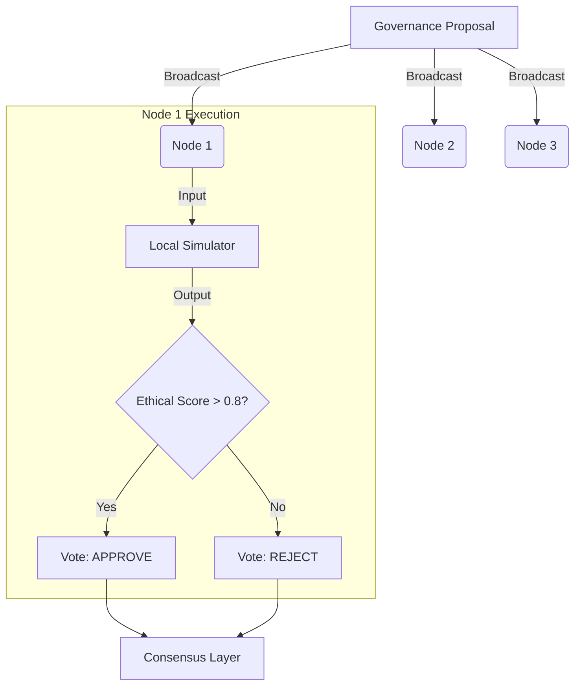

# BLOCK11.2_ARCHITECTURE.md - Ethical Consensus Protocols & Governance SDK

## 1. Overview

Block 11.2 expands the "Ethical Sandbox" of Block 11.1 into a **Federated Governance SDK**. This architecture defines how simulated governance policies are proposed, validated, and propagated across a distributed network of nodes using **Ethical Consensus Protocols**.

## 2. Core Components

### 2.1 Governance SDK (`@quantumpoly/gov-sdk`)

A library exposed to external nodes to participate in the governance network.

- **Interfaces:** `Proposal`, `Vote`, `SimulationResult`.
- **Validation:** Runs the Block 11.1 `simulator` locally on the node to verify policy safety before voting.

### 2.2 Simulation Bridge

Connects the local `simulator/` module to the consensus layer.

- **Role:** Transforms simulation metrics (Friction, Refusal) into a standardized "Ethical Validity Score" (EVS).
- **Thresholds:** Nodes automatically reject proposals if local simulation yields EVS < 0.8.

### 2.3 Ethical Consensus Protocol (ECP-v1)

A variant of Byzantine Fault Tolerance tailored for ethical alignment.

- **Phase 1: Simulation Gating.** Every node simulates the proposal against its local persona set.
- **Phase 2: Metric Gossip.** Nodes share anonymized simulation results (not raw data).
- **Phase 3: Consensus.** If >66% of nodes report EVS > Threshold, the policy is ratified.

## 3. Architecture Diagram (Conceptual)

## 4. Integration with Block 11.1

- **Dependency:** Directly imports `src/lib/simulator`.
- **Extension:** Adds networking and cryptographic signing (Block 9.7) to simulation outputs.

## 5. Next Steps

- [ ] Scaffold `src/lib/governance-sdk/`
- [ ] Define `EthicalConsensus` interface.
- [ ] Implement ECP-v1 message types.

---

**Version:** 1.0
**Last Reviewed:** 2025-11-25
**Reviewed By:** EWA
