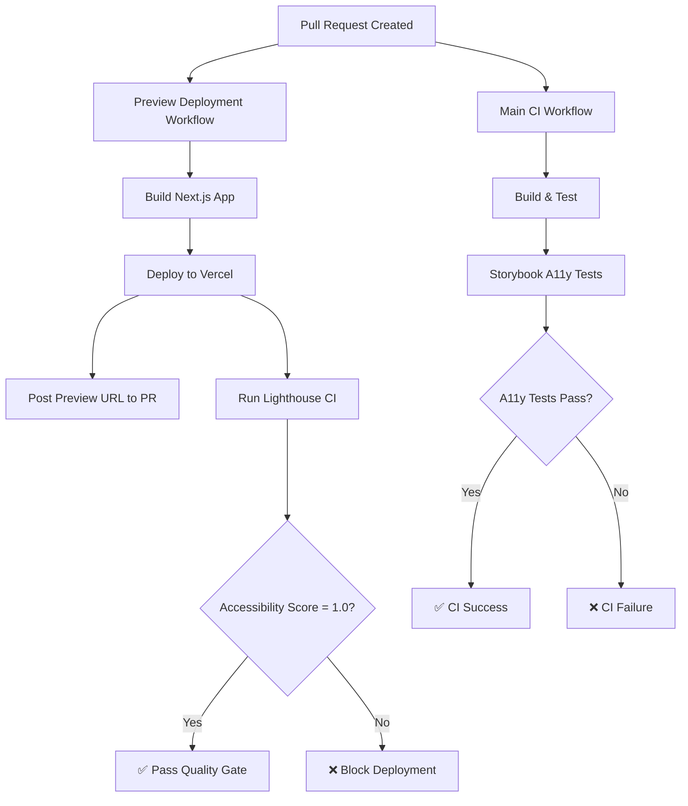

# QuantumPoly Preview Deployment Implementation

## 🎯 **Implementation Summary**

This document outlines the complete implementation of automated preview deployments with strict accessibility and performance gates for the QuantumPoly project.

## 📋 **What Has Been Implemented**

### 1. **Lighthouse CI Configuration** ✅
- **File**: `.lighthouserc.js`
- **Purpose**: Defines quality gates with strict accessibility requirements
- **Quality Standards**:
  - Accessibility: 1.0 (Required - failures block deployment)
  - Performance: ≥ 0.9 (Warning threshold)
  - SEO: ≥ 0.9 (Warning threshold)
  - Best Practices: ≥ 0.9 (Warning threshold)

### 2. **Storybook Accessibility Integration** ✅
- **Updated**: `.storybook/main.ts`
- **Added**: `@storybook/addon-a11y` for visual a11y feedback
- **Added**: `@storybook/test` for automated testing
- **Script**: `storybook:test` for CI execution
- **Features**: Real-time accessibility violation detection in component development

### 3. **Preview Deployment Workflow** ✅
- **File**: `.github/workflows/preview.yml`
- **Integration**: Vercel deployment with GitHub Actions
- **Features**:
  - Auto-deploy every PR to unique preview URL
  - Post preview links to PR comments
  - Run Lighthouse CI against live preview
  - Upload deployment artifacts
  - Automated quality gate enforcement

### 4. **Enhanced Main CI Pipeline** ✅
- **Updated**: `.github/workflows/ci.yml`
- **Added**: Storybook A11y test job
- **Dependencies**: Runs after successful build
- **Artifacts**: Stores Storybook build for review

### 5. **Comprehensive Documentation** ✅
- **ADR-003**: Preview Deployments decision record
- **ADR-004**: Lighthouse & A11y CI decision record
- **Accessibility Guide**: Complete development guidelines
- **Setup Guide**: Step-by-step configuration instructions

### 6. **Package Dependencies** ✅
- **Added**: `@storybook/addon-a11y@^7.5.0`
- **Added**: `@storybook/test@^7.5.0`
- **Added**: `@lhci/cli@^0.13.0`
- **Updated**: Package.json scripts for testing

### 7. **Automation Scripts** ✅
- **File**: `scripts/setup-preview-deployment.sh`
- **Purpose**: Automated setup verification and testing
- **Features**: Prerequisites check, build testing, configuration validation

## 🚀 **Workflow Architecture**



## 🔧 **Setup Requirements**

### GitHub Repository Secrets
```bash
VERCEL_TOKEN=your_vercel_access_token
VERCEL_ORG_ID=your_organization_id
VERCEL_PROJECT_ID=your_project_id
```

### Local Development Setup
```bash
# Install dependencies
npm install

# Verify Storybook with a11y
npm run storybook

# Test builds
npm run build
npm run build-storybook

# Run a11y tests
npm run storybook:test

# Run setup verification
./scripts/setup-preview-deployment.sh
```

## 📊 **Quality Gates & Enforcement**

### Accessibility Requirements (Strict)
- **Score**: Must be 1.0 (100%)
- **Standards**: WCAG 2.1 AA compliance
- **Testing**: Dual-layer (Lighthouse + Storybook)
- **Enforcement**: Blocks deployment on failures

### Performance Monitoring (Warnings)
- **Performance**: Target ≥ 0.9 (90%)
- **SEO**: Target ≥ 0.9 (90%)
- **Best Practices**: Target ≥ 0.9 (90%)
- **Action**: Generates warnings, doesn't block

### Component-Level Testing
- **Tool**: Storybook + @storybook/addon-a11y
- **Coverage**: All stories automatically tested
- **Integration**: CI pipeline with build artifacts
- **Feedback**: Real-time violations in development

## 🎯 **Success Criteria Achievement**

✅ **Every PR auto-deploys a Preview** (Vercel workflow)  
✅ **Preview URL posted to PR comments** (GitHub Actions integration)  
✅ **Lighthouse CI runs against preview** (Live URL testing)  
✅ **Accessibility score = 1.0 required** (Strict enforcement)  
✅ **Performance & SEO ≥ 0.9 warnings** (Monitoring thresholds)  
✅ **Storybook a11y test job passes** (Component-level testing)  
✅ **ADRs present and linked** (Decision documentation)  
✅ **CI fully green only when gates pass** (Quality enforcement)

## 🛠 **Usage Instructions**

### For Developers
1. **Create Feature Branch**: `git checkout -b feature/your-feature`
2. **Develop with A11y**: Use Storybook to check accessibility while coding
3. **Commit & Push**: Push changes to trigger workflows
4. **Create Pull Request**: Auto-deployment and testing begins
5. **Review Results**: Check PR comments for preview URL and quality scores
6. **Fix Issues**: Address any accessibility violations before merge

### For Reviewers
1. **Access Preview**: Click preview URL in PR comments
2. **Test Functionality**: Use both main app and Storybook links
3. **Check Quality Gates**: Review Lighthouse CI results in workflow
4. **Verify Accessibility**: Ensure all tests pass before approval

### For Stakeholders
1. **Live Review**: Access preview deployments without technical setup
2. **Quality Transparency**: View quality scores and trends
3. **Compliance Assurance**: Automated WCAG 2.1 AA verification

## 🔍 **Monitoring & Maintenance**

### Daily Monitoring
- PR deployment success rates
- Accessibility score trends
- Performance metric tracking

### Weekly Reviews
- Lighthouse CI report analysis
- Failed deployment investigation
- Team accessibility training needs

### Monthly Maintenance
- Dependency updates (Lighthouse CI, Storybook)
- Quality threshold adjustments
- Documentation updates based on team feedback

## 🚨 **Emergency Procedures**

### Accessibility Failures
1. **Immediate**: Deployment blocked automatically
2. **Investigation**: Check Lighthouse CI report details
3. **Remediation**: Fix violations using accessibility guide
4. **Verification**: Re-run tests to confirm resolution

### Deployment Issues
1. **Check Logs**: Review GitHub Actions workflow logs
2. **Verify Secrets**: Ensure Vercel credentials are valid
3. **Fallback**: Manual deployment if needed for critical fixes
4. **Escalation**: Contact DevOps team for infrastructure issues

## 📚 **Documentation References**

- [Preview Deployment Setup Guide](./docs/PREVIEW_DEPLOYMENT_SETUP.md)
- [Accessibility Development Guide](./docs/ACCESSIBILITY_GUIDE.md)
- [ADR-003: Preview Deployments](./docs/adr/ADR-003-preview-deployments.md)
- [ADR-004: Lighthouse & A11y CI](./docs/adr/ADR-004-lighthouse-a11y.md)

## 🎉 **Project Impact**

### Developer Experience
- **Faster Reviews**: Live previews eliminate local setup friction
- **Quality Assurance**: Automated gates prevent accessibility regressions
- **Learning**: Real-time feedback improves accessibility knowledge

### Stakeholder Benefits
- **Easy Access**: Non-technical stakeholders can review live changes
- **Quality Visibility**: Transparent metrics and compliance tracking
- **Risk Reduction**: Automated prevention of accessibility violations

### Business Value
- **Compliance**: Automated WCAG 2.1 AA standard enforcement
- **Performance**: Continuous monitoring prevents degradation
- **Efficiency**: Streamlined review process accelerates development

---

## 🚀 **Ready for Production**

Your QuantumPoly project now has enterprise-grade CI/CD with:
- ✅ Automated preview deployments
- ✅ Strict accessibility enforcement
- ✅ Performance monitoring
- ✅ Component-level a11y testing
- ✅ Comprehensive documentation
- ✅ Emergency procedures

**Next Step**: Create a pull request to see the automated preview deployment and quality gates in action!

---

*Implementation completed by Professor Doctor Julius Prompto - Elite CI/A11y Architect*
