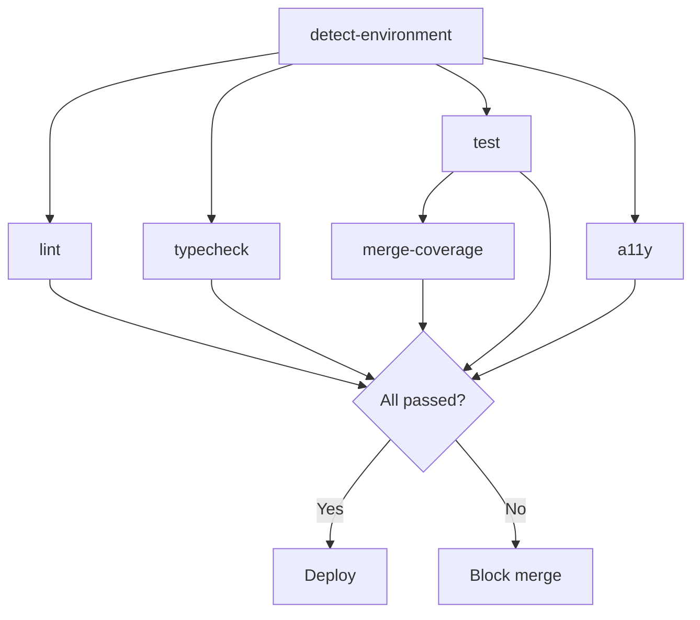

# CI Workflow Maintenance Guide

## Overview

This guide provides maintainers with comprehensive instructions for customizing, extending, and troubleshooting the GitHub Actions CI workflow (`.github/workflows/ci.yml`).

The workflow implements a modular, detection-based architecture that automatically adapts to project dependencies and configuration changes.

---

## Architecture Summary

### Job Dependency Graph

```
detect-environment (runs first)
    ├── lint (parallel)
    ├── typecheck (parallel)
    ├── test (parallel)
    │   └── merge-coverage (sequential)
    └── a11y (conditional, parallel)
```

### Modular Scripts

| Script                              | Purpose                                                          | Usage                            |
| ----------------------------------- | ---------------------------------------------------------------- | -------------------------------- |
| `.github/scripts/detect-env.js`     | Auto-detect test frameworks, package managers, and Node versions | Runs in `detect-environment` job |
| `.github/scripts/merge-coverage.js` | Merge coverage reports from multiple Node versions               | Runs in `merge-coverage` job     |

---

## Extending the Matrix

### 1. Adding Operating Systems (macOS, Windows)

To test across multiple operating systems, update the matrix strategy in each job.

#### Before (Linux only):

```yaml
jobs:
  lint:
    runs-on: ${{ matrix.os }}
    strategy:
      matrix:
        os: [ubuntu-latest]
        node-version: [18.x, 20.x]
```

#### After (Multi-OS):

```yaml
jobs:
  lint:
    runs-on: ${{ matrix.os }}
    strategy:
      matrix:
        os: [ubuntu-latest, macos-latest, windows-latest]
        node-version: [18.x, 20.x]
```

**Impact:**

- Job count increases from 2 to 6 (3 OS × 2 Node versions)
- CI runtime increases proportionally
- Windows-specific issues may surface (path separators, shell differences)

**Recommendations:**

- Start with `ubuntu-latest` and `macos-latest` only
- Add Windows only if deploying desktop apps or Windows-specific features
- Use `exclude` to skip redundant combinations:

```yaml
strategy:
  matrix:
    os: [ubuntu-latest, macos-latest, windows-latest]
    node-version: [18.x, 20.x]
    exclude:
      # Only test Windows on Node 20.x
      - os: windows-latest
        node-version: 18.x
```

---

### 2. Adding Node.js Versions

To test additional Node versions (e.g., Node 21.x, 22.x):

```yaml
strategy:
  matrix:
    os: [ubuntu-latest]
    node-version: [18.x, 20.x, 21.x, 22.x]
```

**Auto-Detection Integration:**

The `detect-env.js` script reads from `package.json` engines. To keep CI aligned with your declared support:

```json
{
  "engines": {
    "node": ">=18.0.0"
  }
}
```

The script will suggest Node versions based on this constraint in the environmental consistency audit.

---

### 3. Matrix Combinations with Custom Variables

For complex scenarios (e.g., testing with different database backends):

```yaml
strategy:
  matrix:
    os: [ubuntu-latest]
    node-version: [18.x, 20.x]
    database: [postgres, mysql, sqlite]
    include:
      # Only test Postgres + MySQL on Node 20.x
      - os: ubuntu-latest
        node-version: 20.x
        database: postgres
      - os: ubuntu-latest
        node-version: 20.x
        database: mysql
    exclude:
      # Exclude SQLite from Node 18.x
      - node-version: 18.x
        database: sqlite
```

**Usage in steps:**

```yaml
- name: Setup database
  run: |
    if [[ "${{ matrix.database }}" == "postgres" ]]; then
      docker-compose up -d postgres
    elif [[ "${{ matrix.database }}" == "mysql" ]]; then
      docker-compose up -d mysql
    fi
```

---

## Environmental Consistency Audit

### Understanding the Audit

The `detect-environment` job compares your CI matrix against the deployed runtime (Vercel, AWS Lambda, etc.).

**Audit Sources:**

1. **Vercel Runtime:** Reads from `vercel.json` or `package.json` engines
2. **CI Matrix:** Defined in workflow `node-version` array

**Audit Outcomes:**

| Condition                       | Output                                       | Action Required                      |
| ------------------------------- | -------------------------------------------- | ------------------------------------ |
| Vercel version in CI matrix     | ✅ Status: CI matrix includes Vercel runtime | None                                 |
| Vercel version not in CI matrix | ⚠️ Warning: Runtime not tested in CI         | Add runtime version to matrix        |
| Vercel version unknown          | ⚠️ Warning: Unable to detect runtime         | Add `engines.node` to `package.json` |

**Example Package.json Configuration:**

```json
{
  "engines": {
    "node": ">=18.0.0 <21.0.0",
    "npm": ">=9.0.0"
  }
}
```

**Example Vercel.json Configuration:**

```json
{
  "functions": {
    "**/*": {
      "runtime": "nodejs20.x"
    }
  }
}
```

---

## Coverage Merging for Governance Dashboard

### Purpose

The `merge-coverage` job consolidates coverage reports from all Node versions into a single `coverage-summary.json` file.

**Governance Dashboard Integration:**

1. **Artifact Download:** Fetch the `coverage-summary` artifact from workflow runs
2. **Metrics Extraction:** Parse `global.lines`, `global.branches`, etc.
3. **Trend Analysis:** Compare against historical coverage data
4. **Compliance Checks:** Verify coverage meets organizational thresholds (e.g., ≥80%)

### Output Format

```json
{
  "timestamp": "2025-10-21T12:00:00.000Z",
  "nodeVersions": ["18.x", "20.x"],
  "global": {
    "statements": 87.5,
    "functions": 89.2,
    "branches": 82.3,
    "lines": 88.1
  },
  "files": {
    "src/components/Button.tsx": {
      "versions": {
        "18.x": { "statements": { "pct": 90.0 } },
        "20.x": { "statements": { "pct": 88.0 } }
      },
      "merged": { "statements": 89.0 }
    }
  },
  "byNodeVersion": {
    "18.x": { "files": { ... } },
    "20.x": { "files": { ... } }
  }
}
```

### Customizing Coverage Merging

To change the merging strategy (e.g., use maximum instead of average):

**Edit `.github/scripts/merge-coverage.js`:**

```javascript
// Change from average to maximum
average(versions.map((v) => v.statements.pct));
// to
Math.max(...versions.map((v) => v.statements.pct));
```

---

## Security Scanning Integration (ADR-007)

### Enabling CodeQL Analysis

Uncomment the `security` job in `.github/workflows/ci.yml`:

```yaml
security:
  name: Security Scanning
  needs: detect-environment
  runs-on: ubuntu-latest
  permissions:
    security-events: write
    actions: read
    contents: read
  steps:
    - name: Checkout repository
      uses: actions/checkout@v4

    - name: Initialize CodeQL
      uses: github/codeql-action/init@v3
      with:
        languages: javascript, typescript

    - name: Perform CodeQL Analysis
      uses: github/codeql-action/analyze@v3
```

**Requirements:**

- Enable GitHub Advanced Security in repository settings
- Grant `security-events: write` permission

**Configuration Options:**

```yaml
- name: Initialize CodeQL
  uses: github/codeql-action/init@v3
  with:
    languages: javascript, typescript
    queries: security-and-quality # or security-extended
    config-file: ./.github/codeql/config.yml
```

### Enabling Snyk Scanning

**Prerequisites:**

1. Create Snyk account at https://snyk.io
2. Generate API token from Snyk dashboard
3. Add `SNYK_TOKEN` to GitHub repository secrets

**Uncomment Snyk step:**

```yaml
- name: Run Snyk Security Scan
  uses: snyk/actions/node@master
  env:
    SNYK_TOKEN: ${{ secrets.SNYK_TOKEN }}
  with:
    args: --severity-threshold=high --fail-on=upgradable
```

**Severity Thresholds:**

- `low`: All vulnerabilities fail the build
- `medium`: Medium, high, and critical fail
- `high`: High and critical fail (recommended)
- `critical`: Only critical vulnerabilities fail

---

## Conditional Job Execution

### Skip Jobs on Specific Branches

To skip accessibility tests on `develop` branch:

```yaml
a11y:
  if: |
    github.ref != 'refs/heads/develop' &&
    (github.event.inputs.run_a11y == 'true' ||
     github.event_name == 'pull_request')
```

### Run Jobs Only on PRs

```yaml
lint:
  if: github.event_name == 'pull_request'
```

### Run Jobs Only on Main Branch

```yaml
merge-coverage:
  if: github.ref == 'refs/heads/main'
```

---

## Performance Optimization

### Caching Strategies

**Current Implementation:**

```yaml
- uses: actions/setup-node@v4
  with:
    node-version: 20.x
    cache: 'npm'
```

**Advanced Caching (Next.js build cache):**

```yaml
- name: Cache Next.js build
  uses: actions/cache@v4
  with:
    path: |
      ~/.npm
      ${{ github.workspace }}/.next/cache
    key: ${{ runner.os }}-nextjs-${{ hashFiles('**/package-lock.json') }}-${{ hashFiles('**/*.js', '**/*.jsx', '**/*.ts', '**/*.tsx') }}
    restore-keys: |
      ${{ runner.os }}-nextjs-${{ hashFiles('**/package-lock.json') }}-
```

### Parallelization

**Current:** Jobs run in parallel after `detect-environment` completes.

**Optimization:** If detection is not required, remove `needs: detect-environment`:

```yaml
lint:
  # Remove: needs: detect-environment
  runs-on: ubuntu-latest
```

**Trade-off:** Lose auto-detection benefits but gain ~10-15 seconds per workflow run.

---

## Troubleshooting

### Issue: Workflow Fails at Environment Detection

**Symptom:**

```
Error: Cannot read property 'dependencies' of null
```

**Solution:**
Ensure `package.json` exists and is valid JSON:

```bash
npm install --package-lock-only
git add package.json package-lock.json
```

---

### Issue: Coverage Merge Job Fails

**Symptom:**

```
Error: No coverage files found to merge
```

**Cause:** Test job failed before uploading artifacts.

**Solution:**

1. Check test job logs for failures
2. Verify `coverage/` directory is generated locally:
   ```bash
   npm run test:coverage
   ls -la coverage/
   ```

---

### Issue: Node Version Mismatch Warning

**Symptom:**

```
⚠️ Warning: Vercel runtime (20.x) not tested in CI matrix (18.x)
```

**Solution:**
Add Vercel's runtime version to the matrix:

```yaml
strategy:
  matrix:
    node-version: [18.x, 20.x] # Ensure 20.x is present
```

---

### Issue: Accessibility Job Always Skips

**Cause:** `@axe-core/playwright` not detected in dependencies.

**Solution:**
Install accessibility testing tools:

```bash
npm install --save-dev @playwright/test @axe-core/playwright
npx playwright install chromium
```

---

## Best Practices

### 1. Pin Action Versions

Always use specific major versions or commit SHAs:

```yaml
# Good
uses: actions/checkout@v4
uses: actions/setup-node@v4

# Better (for security-critical workflows)
uses: actions/checkout@b4ffde6  # SHA pinning
```

### 2. Fail Fast Configuration

For large matrices, fail fast to save CI minutes:

```yaml
strategy:
  fail-fast: true
  matrix:
    os: [ubuntu-latest, macos-latest, windows-latest]
```

**When to Use:**

- Development branches (fail quickly on first error)
- Experimental feature branches

**When to Avoid:**

- Release branches (need complete test coverage across all platforms)
- Pull requests (maintainers need visibility into all failures)

### 3. Artifact Retention Policy

Default: 30 days. Adjust based on compliance requirements:

```yaml
- uses: actions/upload-artifact@v4
  with:
    retention-days: 90 # For regulatory compliance
```

**Cost Considerations:**

- Artifacts count toward storage limits
- Longer retention = higher storage costs
- Archive old artifacts to external storage if needed

---

## Workflow Diagram



---

## Additional Resources

- [GitHub Actions Documentation](https://docs.github.com/en/actions)
- [Next.js CI/CD Best Practices](https://nextjs.org/docs/deployment)
- [Jest Coverage Configuration](https://jestjs.io/docs/configuration#coveragethreshold-object)
- [Playwright Test Configuration](https://playwright.dev/docs/test-configuration)
- [CodeQL Documentation](https://codeql.github.com/docs/)

---

## Change Log

| Date       | Version | Change                          | Author             |
| ---------- | ------- | ------------------------------- | ------------------ |
| 2025-10-21 | 1.0.0   | Initial workflow implementation | QuantumPoly DevOps |

---

## Contact

For questions or issues related to the CI workflow:

1. **Internal:** Create an issue in the QuantumPoly repository
2. **External Contributors:** Reference this guide in pull request discussions
3. **Security Issues:** Follow responsible disclosure via security policy

---

**Document Status:** ✅ Production-Ready  
**Reviewed By:** CASP Lead Architect  
**Next Review Date:** 2025-11-21
