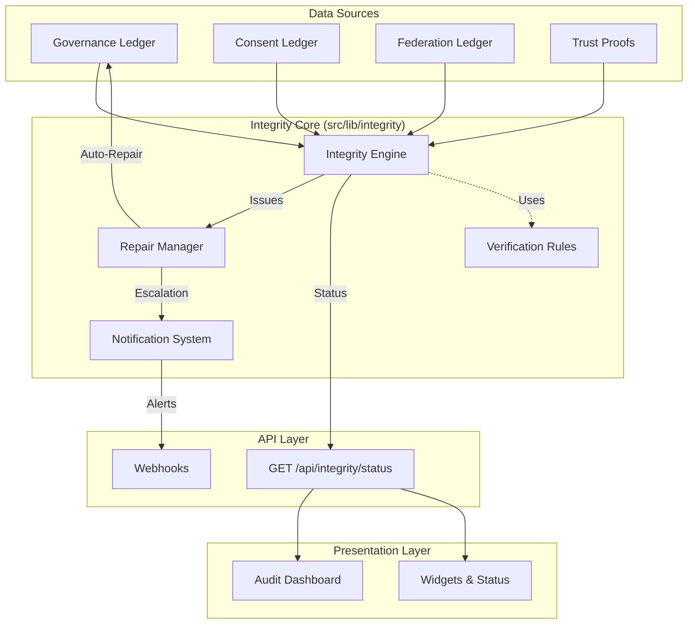

# Integrity Module Architecture

**Document ID:** ARCH-INTEGRITY-001  
**Status:** DRAFT  
**Related Spec:** FPP-07

## Overview

The Integrity Module provides continuous verification, self-healing, and transparency for the QuantumPoly governance ecosystem. It ensures that all ledgers (Governance, Consent, Federation, Trust) remain immutable, consistent, and verifiable.

## Architecture Diagram

## Key Components

### 1. Integrity Engine (`src/lib/integrity/engine.ts`)

The core orchestrator that:

- Reads all ledger files.
- Applies verification rules (hash chains, chronology, schema validation).
- Aggregates system health state.
- Computes global Merkle root.

### 2. Repair Manager (`src/lib/integrity/repair-manager.ts`)

Handles detected issues by:

- Classifying them as `auto-repairable` or `escalation-required`.
- Applying conservative repairs (e.g., fixing stale dates).
- Appending `autonomous_repair` entries to the governance ledger.

### 3. Metric Aggregators (`src/lib/integrity/metrics/`)

- **EII (`eii.ts`)**: Calculates Ethics Integrity Index from ledger entries.
- **Consent (`consent.ts`)**: Aggregates privacy-preserving consent statistics.

### 4. Ledger Readers (`src/lib/integrity/ledger/reader.ts`)

- Provides type-safe access to JSONL files.
- Implements cryptographic verification (SHA-256, Merkle Trees).

## Data Flow

1.  **Trigger**: Scheduled GitHub Action or API request.
2.  **Verification**: Engine reads ledgers and checks for anomalies.
3.  **Assessment**: Issues are classified by severity.
4.  **Action**:
    - **Healthy**: Status updated.
    - **Minor Issue**: Repair Manager fixes it and logs an entry.
    - **Critical Issue**: Notification System alerts admins.
5.  **Reporting**: Final state is exposed via `/api/integrity/status`.

## Module Dependencies

- **Internal**: `fs`, `crypto`, `path` (Node.js built-ins)
- **External**: `next-intl` (for localized reports), `zod` (for schema validation)

## Security & Privacy

- **Immutability**: All ledger modifications are append-only with hash chaining.
- **Privacy**: Consent metrics are aggregated; no PII is exposed or logged in the dashboard.
- **Transparency**: Public API allows anyone to verify the system state.
