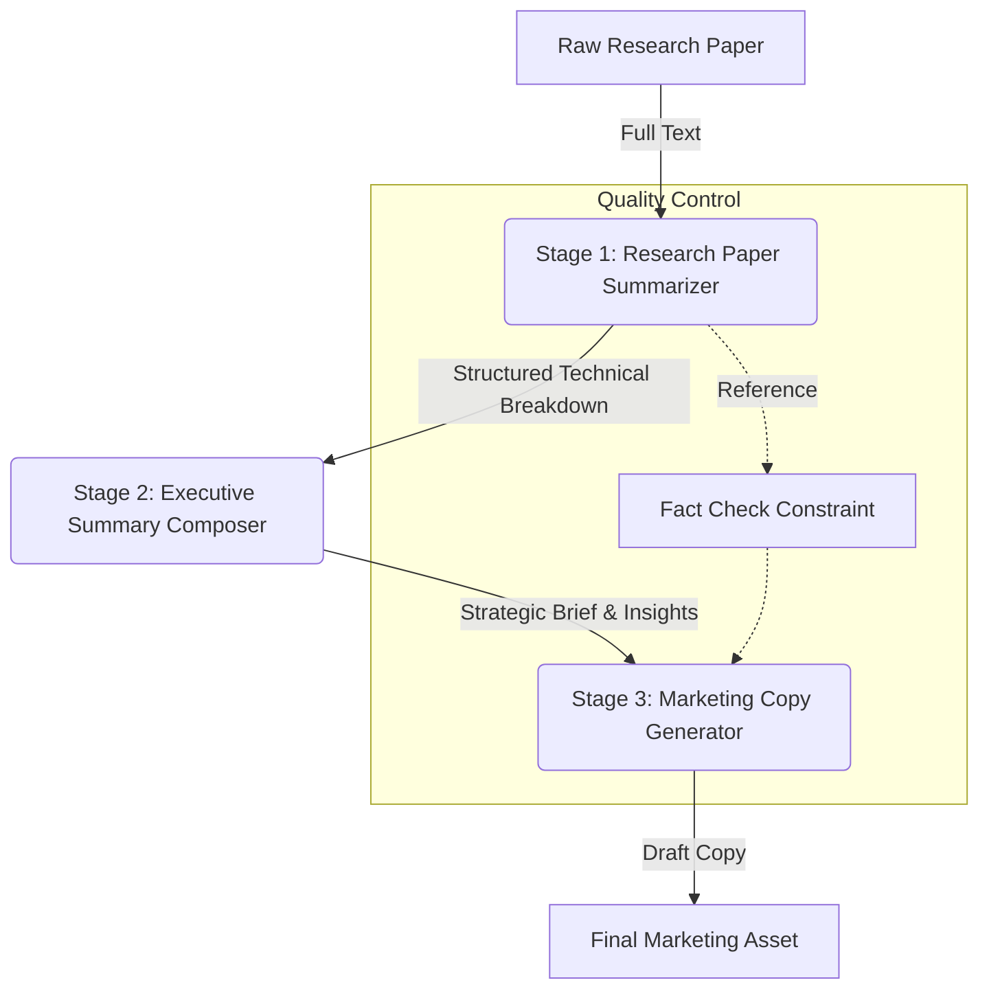

# Research to Marketing Automation Pipeline

## 1. Purpose of the Workflow

This pipeline automates the transformation of complex, high-density academic or technical research into engaging, public-ready marketing communications.

**Target Audience:**

- **Primary:** Marketing Teams, Content Strategists, Public Relations Officers.
- **Secondary:** Product Managers, Executive Leadership (for rapid insight assimilation).

**Goal:** To accelerate the "time-to-insight" and "time-to-market" for research-driven organizations, ensuring that technical breakthroughs are accurately translated into compelling value propositions without manual synthesis bottlenecks.

## 2. Workflow Overview

The pipeline operates as a linear, three-stage transformation chain:

1.  **Ingestion & Distillation:** A raw research paper is analyzed and compressed into a structured technical summary, stripping away academic formatting while retaining core methodology and findings.
2.  **Strategic Synthesis:** The technical summary is converted into an executive brief, focusing on business implications, decision-making value, and high-level outcomes.
3.  **Creative Adaptation:** The executive brief serves as the source of truth for generating targeted marketing assets (e.g., press releases, blog posts), ensuring the final creative copy is grounded in factual accuracy.

## 3. Detailed Breakdown of Each Stage

### Stage 1: Research Paper Summarizer

- **Task:** Deconstruct full-length academic papers.
- **Input:** Raw text of PDF research papers, technical reports, or white papers (2k–10k+ words).
- **Output:** A "Structured Technical Breakdown" containing:
  - Core Hypothesis
  - Methodology (Simplified)
  - Key Statistical Findings
  - Direct Implications
- **Rationale:** Academic texts are token-heavy and filled with jargon. Direct processing by a creative model often leads to hallucinations or loss of nuance. This stage acts as a high-fidelity compression filter.

### Stage 2: Executive Summary Composer (Existing Module)

- **Task:** Translate technical facts into strategic value.
- **Input:** The "Structured Technical Breakdown" from Stage 1.
- **Output:** A standard Executive Brief (≤250 words) + Key Insights + Next Steps.
- **Rationale:** Marketing tools need a "message hook," not a methodology review. This stage bridges the gap between "what happened" (science) and "why it matters" (business).

### Stage 3: Marketing Copy Generator

- **Task:** Craft audience-centric narratives.
- **Input:** The Executive Brief and Key Insights from Stage 2.
- **Output:** A specific marketing asset (Press Release, Blog Post, Social Thread) with appropriate tone, headlines, and call-to-action.
- **Rationale:** Separating creation from understanding ensures the "voice" doesn't get mixed with the "facts." It allows for rapid re-spinning of content (e.g., "make it punchier") without re-reading the original technical paper.

## 4. Inter-Stage Logic & Data Handoff

| From Stage           | To Stage             | Data Object Transferred               | Critical Check                                                 |
| :------------------- | :------------------- | :------------------------------------ | :------------------------------------------------------------- |
| **1. Summarizer**    | **2. Exec Composer** | `Technical_Breakdown` (JSON/Markdown) | Ensure statistical significance and limitations are preserved. |
| **2. Exec Composer** | **3. Marketing Gen** | `Strategic_Brief` (Markdown)          | Verification that "Next Steps" align with the "Key Insights."  |

**Handoff Protocol:**

- Each stage outputs clean Markdown.
- No stage should "guess" missing info; if Stage 1 misses a detail, Stage 2 should flag it rather than hallucinate.

## 5. Risks & Error Points

- **Dilution of Accuracy:** As information moves away from the source, nuances (e.g., "95% confidence interval") may turn into absolutes (e.g., "proven fact").
  - _Mitigation:_ Stage 3 prompts must include a constraint: "Do not overstate claims beyond the provided brief."
- **Tone Misalignment:** The Executive Brief might be too dry for a consumer blog post.
  - _Mitigation:_ Stage 3 explicitly requests "Brand Voice" parameters (e.g., "Exciting," "Professional," "Urgent").
- **Hallucination in Gaps:** If the research paper is vague, Stage 1 might invent details.
  - _Mitigation:_ Stage 1 instruction: "If methodology is unclear, state 'Methodology not specified' instead of inferring."

## 6. Recommendations for Improvement

- **Validation Loop:** Insert a "Fact-Check" agent between Stage 3 and final delivery that compares the Press Release claims against the Stage 1 Technical Breakdown.
- **Multi-Format Branching:** After Stage 2 (Executive Brief), branch into parallel Stage 3 processes: one for a Tweet thread, one for a LinkedIn article, and one for an internal memo.
- **Feedback Integration:** Allow the user to reject the Executive Brief, triggering a re-run of Stage 2 with specific focus adjustments before generating marketing copy.

## 7. Final Optimized Pipeline

**List Format:**

1.  **Input:** Upload Research Paper.
2.  **Process 1:** `run research_paper_summarizer` → Output: Technical Breakdown.
3.  **Process 2:** `run executive_summary_composer` (Input: Technical Breakdown) → Output: Strategic Brief.
4.  **Process 3:** `run marketing_copy_generator` (Input: Strategic Brief) → Output: Press Release / Blog.
5.  **Output:** Final Review & Publish.
